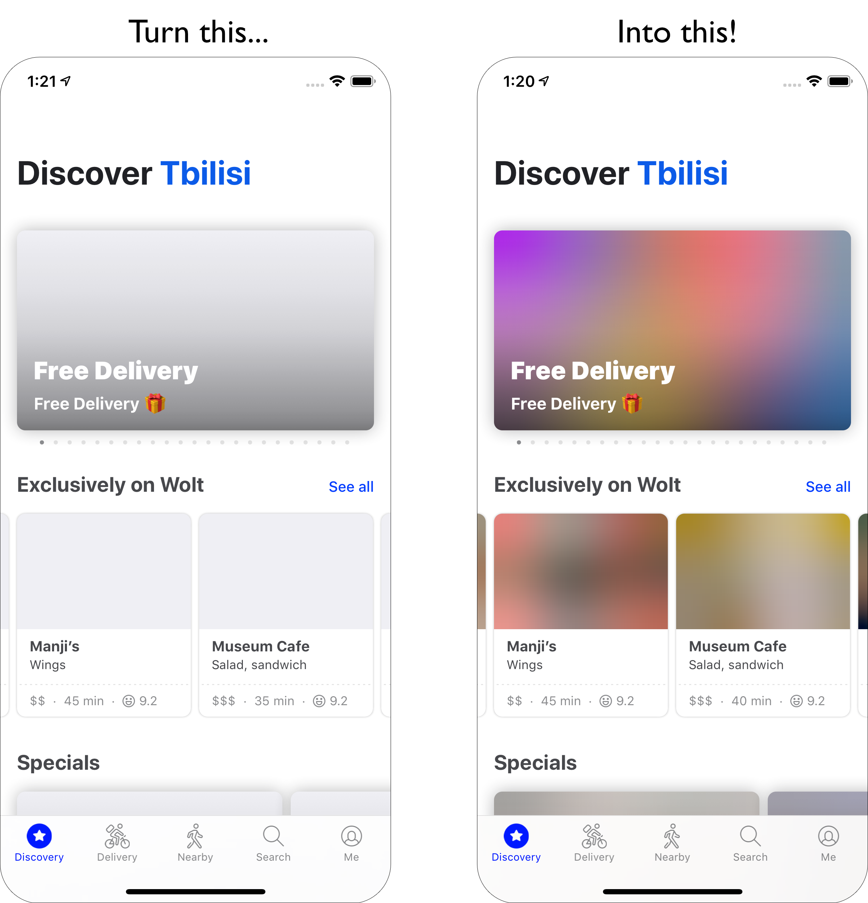
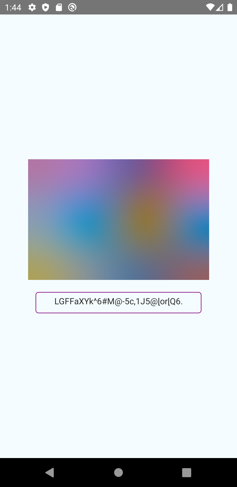

# Blurhash

```sh
npm i react-native-blurhash
cd ios; pod install; cd ..
```

**BlurHash** is a compact representation of a placeholder for an image. This is a Native UI Module for React Native to wrap the Blurhash implementations and make them usable in React Native.



## Example Workflow

In order to use the Blurhash component, you have to already have a Blurhash string. See the [blurha.sh](https://blurha.sh) page to create example strings.

This is how I use it in my project:

1. A user uploads images from the react native app to firebase
2. In firebase, I have a storage trigger function that generates a blurhash string from the uploaded image using the [TypeScript implementation](https://github.com/woltapp/blurhash/blob/master/TypeScript/src/encode.ts)
3. After I generated the blurhash string, I set this as a property on my `post` document in Firestore.
4. Now everytime a user loads a feed of posts from my Firestore database, the `blurhash` property can be used to display the loading placeholder.

## About

The decoders are written in [Swift](ios/BlurhashDecode.swift) and [Kotlin](android/src/main/java/com/blurhash/BlurhashDecode.java), and are copied from the official [woltapp/blurhash](https://github.com/woltapp/blurhash) repository. I use caching techniques, to only re-render the (quite expensive) Blurhash image creation when one of the blurhash specific props (`blurhash`, `width`, `height` or `punch`) has changed.

<table>
  <tr>
    <th>Name</th>
    <th>Type</th>
    <th>Explanation</th>
    <th>Required</th>
    <th>Default Value</th>
  </td>
  <tr>
    <td><code>blurhash</code></td>
    <td>string</td>
    <td>The blurhash string to use</td>
    <td>✅</td>
    <td><code>undefined</code></td>
  </tr>
  <tr>
    <td><code>width</code></td>
    <td>number</td>
    <td>The width to decode to. You can still up-/down-scale it in React</td>
    <td>✅</td>
    <td><code>undefined</code></td>
  </tr>
  <tr>
    <td><code>height</code></td>
    <td>number</td>
    <td>The height to decode to. You can still up-/down-scale it in React</td>
    <td>✅</td>
    <td><code>undefined</code></td>
  </tr>
  <tr>
    <td><code>punch</code></td>
    <td>number</td>
    <td>The punch to use for decoding.</td>
    <td>❌</td>
    <td><code>1</code></td>
  </tr>
</table>

> Read the [algorithm description](https://github.com/woltapp/blurhash/blob/master/Algorithm.md) for more details


<table>
  <tr>
    <th>iOS Screenshot</th>
    <th>Android Screenshot</th>
  </td>
  <tr>
    <td></td>
    <td></td>
  </tr>
</table>


## Resources
* [this medium article. jesus christ amen thanks for that](https://teabreak.e-spres-oh.com/swift-in-react-native-the-ultimate-guide-part-2-ui-components-907767123d9e)
